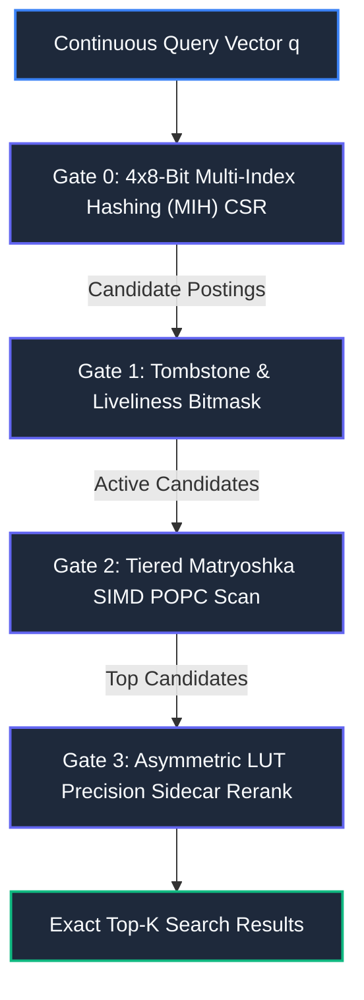

# Pithos — Technical Architecture & Agent Guide

This document is a complete architectural overview of the Pithos Vector Search Engine, written for AI agents, developers, and systems engineers. It explains Pithos' mechanics, features, and integration methods without unverified benchmark metrics.

---

## 1. System Overview

Pithos is an Ahead-of-Time (AOT) compiled, model-isomorphic vector database (MIDB). Unlike conventional vector databases that treat embeddings as arbitrary geometric points and construct high-overhead graph structures (such as HNSW), Pithos physically aligns its in-memory and on-disk columnar structures with the underlying mathematical geometry of neural representation models.

### Core Architectural Pillars
- **Zero-GC Off-Heap Memory:** Uses Java 25 Foreign Function and Memory (FFM) API and POSIX virtual memory mapping (`mmap`) to operate directly in native off-heap memory, eliminating JVM garbage collection pauses and heap allocation overhead.
- **Model-Isomorphic Layout:** Combines randomized sign preconditioning, block-diagonal Walsh-Hadamard rotations, and Matryoshka dimension tiers to project continuous vectors into cache-line aligned binary and low-precision float sidecar columns.
- **Self-Contained Single-File Containers (`.pithos`):** Encapsulates vector IDs, quantization tiers, precision sidecars, inverted prefix hash tables, embedded Apache Arrow metadata, and JSON directories into a single portable binary file.
- **Native Multi-Language Interoperability:** Compiled into a standalone native shared library (`libpithos.so` / `libpithos.dylib`) via GraalVM Native Image, callable with zero-overhead FFI from Python, C/C++, Rust, Go, and Java.

---

## 2. Mathematical & Algorithmic Foundations

Pithos translates floating-point vector similarity into fast bitwise operations through a sequence of orthogonal transformations:

### 2.1 Rademacher Sign Preconditioning
Raw input embedding vectors are multiplied elementwise by a pseudo-random diagonal sign operator:
- Flips coordinate signs with equal probability (+1 or -1).
- Whitens directional coordinate bias and spreads information density evenly across all dimensions without altering Euclidean or angular distances.

### 2.2 Block-Diagonal Walsh-Hadamard Rotation (WHT)
Instead of applying dense matrix multiplications, Pithos applies recursive Sylvester-Hadamard transforms partitioned across Matryoshka tier widths:
- Operates in $O(D \log D)$ time using fast butterfly addition/subtraction networks.
- Strictly preserves inner products and norms (isometric orthogonal transform).
- Eliminates the need to store or compute large dense projection matrices.

### 2.3 PolarQuant Binarization & Quantization Modes
Transformed coordinates are converted into compact representations:
- **1-Bit Mode (`ONE_BIT`):** Extracts the sign bit ($\ge 0 \to 1$, $< 0 \to 0$), packing 64 dimensions into a single 64-bit integer (`uint64_t`).
- **2-Bit Mode (`TWO_BIT` / QJL):** Stores an active threshold mask and sign bit, enabling ternary residual distance estimation.
- **FP32 Bypass (`FLOAT32`):** Retains raw rotated 32-bit floats for lower-dimensional exact comparisons.

### 2.4 Matryoshka Representation Learning (MRL) Tiers
Pithos exploits the hierarchical structure of modern representation models by slicing dimensions into cumulative prefix tiers (e.g., $T_0 < T_1 < \dots < T_K = D$). Unlikely candidates are pruned at smaller prefix tiers before loading higher-order dimensions.

### 2.5 SVD Spectral Energy Decay
When adapter or projection weights are supplied at index load time, Pithos runs an in-engine Jacobi Singular Value Decomposition (SVD) solver to compute singular values and reconstruct the cumulative spectral energy distribution $\Phi(k)$. An energy budget parameter $\tau \in (0, 1]$ enables dynamic runtime pruning of trailing singular vector columns.

---

## 3. Four-Gate Cascaded Search Pipeline

Every search query cascades through four hardware-aligned evaluation gates:



### Gate 0: 4x8-Bit Multi-Index Hashing (MIH) CSR
- Partitions the first 32/64 bits of the binarized vector into 4 independent 8-bit sub-words (256 buckets per chunk).
- Probes exact query sub-word buckets and adjacent Hamming neighbors via direct-mapped CSR posting lists.
- Dynamically bounds candidate scans before touching main vector memory.
- Uses thread-local zero-allocation bitsets (`ThreadLocal<long[]>`) to track visited candidates without heap allocations.

### Gate 1: Tombstone & Liveliness Bitmask
- Evaluates 64-bit metadata bitmasks in zero clock cycles.
- Instantly bypasses deleted records ($T_i = 1$) or inactive records ($M_i = 0$).

### Gate 2: Tiered Matryoshka SIMD POPC Scan
- Computes partial Hamming distances tier-by-tier across candidates using vectorized CPU instructions (AVX-512 `VPOPCNTDQ`, ARM Neon `cnt` / `addp`, or CUDA kernels).
- Accumulates candidate distances and feeds the top candidates into Gate 3.

### Gate 3: Precision Sidecar Reranking with Monotonic Early Cutoff
- Maps candidate vectors directly from FP8 (E4M3), NVFP4 (E2M1 microscaling), or FP16 precision sidecar memory.
- Precomputes an Asymmetric Query Look-Up Table (Query LUT) in CPU L1 cache for the continuous query vector.
- Computes Euclidean distances using table lookups and integer additions (zero floating-point multiplications).
- Monotonically accumulates partial distances and immediately terminates accumulation if the running sum exceeds the current $k$-th best distance threshold.

---

## 4. Key Engine Features

### 4.1 Universal Single-File Container Format (`.pithos`)
A self-contained file format with 64-byte cache-line alignment:
- **Superblock (128 Bytes):** Fixed magic signature `"DIOGENES"`, format version, vector count, dimension, metric type, sidecar type, tier boundaries, and Table of Contents offset.
- **Section 1 (IDs):** Contiguous `uint64_t` array of vector IDs.
- **Section 2 (Tiers):** Contiguous columnar bitpacked Matryoshka tiers.
- **Section 3 (Sidecar):** Contiguous FP8 E4M3, NVFP4, or FP16 float sidecars.
- **Section 4 (Prefix Table):** CSR bucket offsets (65,537 int32s) and postings for Gate 0 MIH routing.
- **Section 5 (Metadata Payload):** Embedded raw data, JSON Lines, or Apache Arrow IPC streams.
- **Table of Contents (TOC):** JSON directory describing section offsets, lengths, data types, and custom user metadata.
- **Trailer (20 Bytes):** Magic signature `"PITHOSDB"`, TOC offset, and TOC length for integrity verification.

### 4.2 Embedded Apache Arrow IPC Partition Directory
- Allows bundling partition tables, schemas, and tabular metadata directly inside the `.pithos` single-file container (1 Inode architecture).
- Read directly via `index.arrow_table` in Python without extracting to disk.

### 4.3 LSM DeltaBuffer & Write-Ahead Log (WAL)
- **Real-Time Mutations:** Supports lock-free concurrent inserts and soft-deletes via LMAX Disruptor 4.0.0 ring buffers.
- **Crash Resilience:** Mutation events are recorded in an append-only binary Write-Ahead Log (`_wal.bin`).
- **Merged Search (`search_merged`):** Transparently scans both the base immutable memory-mapped index and the active in-memory DeltaBuffer, deduplicating and masking tombstoned IDs.
- **Zero-Cost Compaction:** Multiple index files and flushed delta logs can be consolidated into a single `.pithos` container.

### 4.4 Multi-Family Resonant Voting
- Designed for multi-archetype consensus matching, multi-query aggregation, and anomaly detection.
- Evaluates $M$ queries split across $F$ distinct families with individual threshold masks.
- Computes thread-local bitwise voting masks and filters records based on family consensus counts.

### 4.5 Hardware Acceleration & Co-Design
- **Zero-Copy DMA / FPGA Access:** `vdb_get_tier_address()` and `vdb_get_metadata_address()` expose raw virtual off-heap memory addresses, enabling FPGA accelerators or PCIe DMA engines to stream columns directly without CPU mediation.
- **NVIDIA CUDA GPU Acceleration:** Native CUDA kernels for batch Hamming distance, Fast Walsh-Hadamard transforms, and multi-family resonant voting with unified host-device memory mapping.

### 4.6 Multi-Layer Zero-Overhead Security Model
- **Defensive Pointer & Range Guards:** All C-API entry points validate pointers, dimension ranges, and top-k limits before dereferencing, preventing `SIGSEGV` errors from untrusted client callers.
- **Container Slicing Bounds Checks:** All section offsets and lengths are verified against the physical file channel size during container mounting.
- **TOC Decompression Guard:** Imposes a strict 10 MB limit on Table of Contents JSON payloads to prevent memory expansion attacks.
- **Path Traversal Sanitization:** Normalizes all paths (`Path.normalize()`) and rejects null-byte injections.
- **Multi-Tenant Memory Isolation:** Thread-local scratch buffers are deterministically wiped before and after query runs.

---

## 5. How to Load, Install & Use Pithos

### 5.1 Python Package (`pithosdb`)

Install via PyPI:
```bash
pip install pithosdb numpy pyarrow
```

Basic Usage:
```python
import numpy as np
from pithos import VectorDb, SidecarMode, QuantizationMode

dim = 384
num_vectors = 10_000
vectors = np.random.randn(num_vectors, dim).astype(np.float32)
vectors /= np.linalg.norm(vectors, axis=1, keepdims=True)

# 1. Compile into a single-file .pithos container
VectorDb.compile_container(
    path="dataset.pithos",
    records=vectors,
    tiers=[64, 128, 256, 384],
    q_mode=QuantizationMode.ONE_BIT,
    sidecar_mode=SidecarMode.FP8,
    user_metadata={"description": "foundation_embeddings"}
)

# 2. Memory-map index & perform zero-copy search
with VectorDb() as db:
    index = db.load_index("my_index", "dataset.pithos")
    query = vectors[0]

    # Standard search returning SearchResult objects
    results = index.search(query, k=10)
    for hit in results:
        print(f"ID: {hit.id}, Distance: {hit.score}")

    # Zero-copy flat NumPy search (returns (out_ids, out_dists) ndarrays)
    ids, dists = index.search_numpy(query, k=10)
```

Real-Time LSM DeltaBuffer Ingestion:
```python
with VectorDb() as db:
    index = db.load_index("my_index", "dataset.pithos")
    delta = db.create_delta_buffer("my_index", flush_threshold=5000)

    # Insert new vector
    new_id = 99999
    new_vec = np.random.randn(384).astype(np.float32)
    delta.insert(new_id, new_vec)

    # Soft-delete existing vector
    delta.delete(0)

    # Merged search across base index and delta buffer
    merged_results = index.search_merged(new_vec, k=5)
```

### 5.2 C / C++ SDK (`pithos.h`)

Include the C header and link against `libpithos`:
```c
#include "pithos.h"
#include <stdio.h>

int main() {
    graal_isolate_t *isolate = NULL;
    graal_isolatethread_t *thread = NULL;
    graal_create_isolate(NULL, &isolate, &thread);

    // Initialize coordinator and load container
    vdb_init(thread);
    vdb_load_index(thread, "my_index", "dataset.pithos");

    float query[384];
    long long out_ids[10];
    int out_dists[10];

    // Batch search across off-heap mapped index
    vdb_batch_search(thread, "my_index", query, 1, 10, out_ids, out_dists);

    for (int i = 0; i < 10; i++) {
        printf("Hit %d: ID=%lld, Dist=%d\n", i, out_ids[i], out_dists[i]);
    }

    vdb_drop_index(thread, "my_index");
    vdb_close(thread);
    graal_tear_down_isolate(thread);
    return 0;
}
```

Building with CMake:
```cmake
find_package(Pithos REQUIRED)
add_executable(my_search_app main.cpp)
target_link_libraries(my_search_app PRIVATE Pithos::pithos)
```

### 5.3 Java 25 Native FFM API (Project Panama)

Pithos can be imported directly in Java 25 applications without JNI wrappers:
```java
import org.pithos.FlatIndex;
import org.pithos.SearchResult;
import java.util.List;

public class App {
    public static void main(String[] args) throws Exception {
        // Zero-copy off-heap memory map of .pithos container
        FlatIndex index = FlatIndex.mapFile("dataset.pithos", null, 0);

        float[] query = new float[384];
        List<SearchResult> results = index.search(query, 10);
        for (SearchResult r : results) {
            System.out.println("ID: " + r.id() + ", Distance: " + r.score());
        }

        index.close();
    }
}
```
