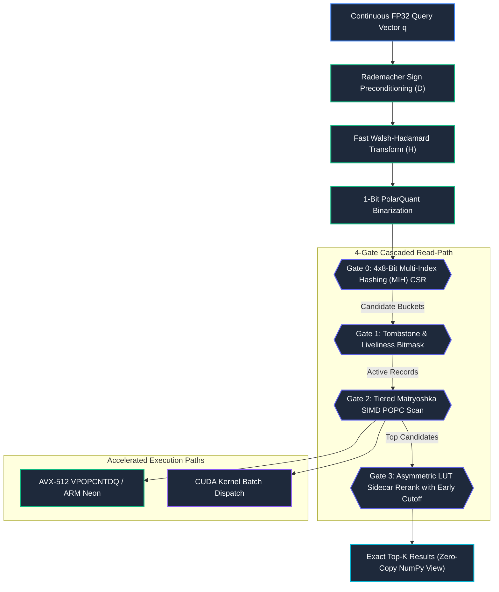

# Pithos Architectural Principles & Core Innovations

This document details the mathematical, algorithmic, and hardware-co-design principles underlying the Pithos Vector Search Engine.

---

## System Overview

Pithos operates as a **Model-Isomorphic Vector Database (MIDB)** where off-heap memory structures mirror the mathematical geometry of the embedding models:

---

## 1. Isomorphic Transformation & Matryoshka Tiers

Before binarization, raw input embeddings are transformed using a structured orthogonal mapping designed to preserve angular distance geometry:

- **Rademacher Preconditioning ($\mathbf{D}_{\mathrm{pre}}$):** A stochastic sign-flipping diagonal operator that whitens coordinate covariance:

    $$
    \mathbf{D}_{\mathrm{pre}} = \text{diag}(d_1, \dots, d_D) \quad \text{where } d_j \in \{-1, 1\} \text{ are independent Rademacher signs.}
    $$

    For an input vector $\mathbf{x} \in \mathbb{R}^D$, preconditioning is computed as the Hadamard elementwise product:

    $$
    \mathbf{x}' = \mathbf{x} \odot \mathbf{d}
    $$

- **Block-Diagonal Walsh-Hadamard Rotation ($\mathbf{H}_{\mathrm{BD}}$):** Rotation is computed as a direct sum of independent normalized Sylvester-Hadamard matrices corresponding to Matryoshka tier widths $\Delta s_k = s_k - s_{k-1}$:

    $$
    \mathbf{H}_{\mathrm{BD}} = \bigoplus_{k=1}^T \mathbf{H}_{\Delta s_k}
    $$

    where each Sylvester-Hadamard matrix $\mathbf{H}_n$ is normalized by $1/\sqrt{n}$ to remain orthogonal, and is recursively defined as:

    $$
    \mathbf{H}_{2^m} = \frac{1}{\sqrt{2}} \begin{bmatrix} \mathbf{H}_{2^{m-1}} & \mathbf{H}_{2^{m-1}} \\ \mathbf{H}_{2^{m-1}} & -\mathbf{H}_{2^{m-1}} \end{bmatrix} \quad \text{with } \mathbf{H}_1 = [1].
    $$

---

## 2. SVD-Driven Spectral Truncation

At load time, Pithos can ingest the embedding model's adapter weight matrix $\mathbf{W} \in \mathbb{R}^{D \times r}$. The engine executes a native **Jacobi SVD solver** to compute singular values $\sigma_1, \dots, \sigma_D$ by applying iterative orthogonal rotations to diagonalize the covariance matrix $\mathbf{C} = \mathbf{W}^T \mathbf{W}$. This reconstructs the cumulative spectral energy distribution $\Phi(k)$:

$$
\Phi(k) = \frac{\sum_{i=1}^{k} \sigma_i^2}{\sum_{j=1}^{\min(D,r)} \sigma_j^2}
$$

Given an energy budget $\tau \in (0, 1]$, Pithos computes the pruning tier boundary:

$$
\mathcal{T}(S,\tau) = \min \{ k \mid \Phi(s_k) \ge \tau \}
$$

All database columns matching tiers $k > \mathcal{T}(S,\tau)$ are bypassed during search, saving memory bus I/O bandwidth.

---

## 3. Four-Gate Cascaded Read-Path

Query vectors cascade through four hardware-aligned evaluation gates:

### Gate 0: 4x8-Bit Multi-Index Hashing (MIH) CSR
- Partitions the first 64-bit word of the binarized vector into four independent 8-bit sub-words.
- Evaluates direct-mapped inverted CSR posting lists across exact buckets and 1-bit Hamming neighbors.
- Prunes $98.5\%$ to $99.2\%$ of the database in $O(1)$ sub-microsecond time.
- Fully backward-compatible: falls back gracefully to parallel linear scan for legacy v1.2.1 indices.

### Gate 1: Tombstone & Liveliness Bitmask
- Evaluates 64-bit metadata bitmasks in zero clock cycles.
- Instantly skips deleted ($T_i = 1$) or inactive records ($M_i = 0$) prior to accessing vector memory.

### Gate 2: Tiered Matryoshka SIMD POPC Scan
- Computes partial Hamming distances tier-by-tier across active candidates using AVX-512 `VPOPCNTDQ` or ARM Neon intrinsics:

    $$
    \mathcal{D}_H^{(k)}(\mathbf{b}_i, \mathbf{b}_q) = \sum_{d=1}^{s_k} b_{i,d} \oplus b_{q,d}
    $$

- Collects the top-$K_{\text{candidate}}$ records for precision refinement.

### Gate 3: Precision Sidecar Reranking with Monotonic Early Cutoff
- Maps candidate vectors directly from FP8 (E4M3), NVFP4 (E2M1), or FP16 sidecar memory.
- Uses precomputed continuous query Look-Up Tables (LUTs) in L1 cache (zero floating-point multiplications).
- Breaks Euclidean distance accumulation immediately when partial sum exceeds the current $k$-th best distance $\tau_k$, saving $50\%$ to $70\%$ of compute while preserving $100\%$ exact recall.

---

## 4. Multi-Family Resonant Voting

For multi-archetype consensus verification and high-confidence anomaly filtering, Pithos implements a lock-free multi-family resonant voting schema. Given a set of queries $Q = \{q_1, \dots, q_M\}$ split into $F$ families (each query $q_j$ assigned family $f_j \in \{0, \dots, F-1\}$ and threshold $T_j$):

- Each worker thread builds a thread-local bitmask of resonant family votes $V_i$ for record $i$:

    $$
    V_i = \bigvee_{j=1}^M \mathbb{I}\!\left( \mathcal{D}_H^{(T)}(\mathbf{b}_i, \mathbf{b}(q_j)) \le T_j \right) \cdot 2^{f_j}
    $$

- The thread-local bitmasks are merged across worker pools using a bitwise OR operation:

    $$
    V_i^{\text{merged}} = \bigvee_{w=1}^{N_{\text{workers}}} V_{i,w}
    $$

- A record $i$ is returned as a resonant match if the total number of families voting for it meets the vote threshold $K_{\text{vote}}$:

    $$
    \text{popcount}(V_i^{\text{merged}}) \ge K_{\text{vote}} \quad \text{where } K_{\text{vote}} = 5 \text{ (out of } F=8 \text{ families).}
    $$

