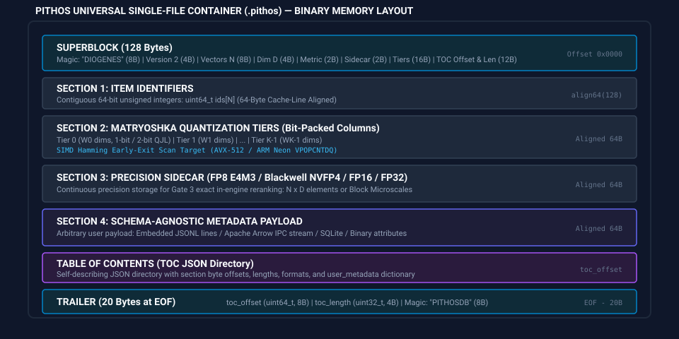

# Universal Single-File Container Format (.pithos) ⚱

---

## Philosophical Heritage: The Urn of Diogenes

In ancient Athens, the philosopher **Diogenes of Sinope** made his dwelling within a *pithos* (πίθος)—a large, self-contained ceramic storage jar. His philosophy was rooted in absolute **autarky** (self-sufficiency), simplicity, and the ruthless elimination of superfluous baggage.

The `.pithos` single-file container format embodies this exact philosophy:
* **100% Self-Contained:** Embedding vectors, quantization tiers, precision sidecars, item IDs, and arbitrary schema-agnostic metadata are encapsulated into a single binary file.
* **Zero Runtime Overhead:** Direct zero-copy memory mapping via Java 25 Foreign Function & Memory (FFM) `MemorySegment.asSlice()` and POSIX `mmap()`.
* **Zero Domain Lock-In:** Schema-agnostic design capable of holding multimodal image embeddings, genomic k-mers, geospatial coordinates, or LLM text vectors without hardcoded assumptions.

---

## Binary Memory Specification (Version 2)

A `.pithos` file is structured into 64-byte cache-line aligned sections with a 128-byte Superblock and a 20-byte Trailer:



### Superblock Layout (128 Bytes, Offset `0x0000`)

| Byte Range | Type | Field Name | Description |
| :--- | :--- | :--- | :--- |
| `0..7` | `char[8]` | `magic_superblock` | Fixed ASCII signature: `"DIOGENES"` (`0x44, 0x49, 0x4F, 0x47, 0x45, 0x4E, 0x45, 0x53`) |
| `8..11` | `int32_t` | `format_version` | Container format version (currently `2`) |
| `12..19` | `uint64_t` | `num_vectors` | Total record count $N$ |
| `20..23` | `int32_t` | `dimension` | Continuous vector dimensionality $D$ |
| `24..25` | `uint16_t` | `metric_type` | Distance metric: `0` = Cosine, `1` = L2 / Euclidean, `2` = Dot Product |
| `26..27` | `uint16_t` | `sidecar_type` | Precision sidecar: `0` = None, `1` = FP16, `2` = FP8 E4M3, `3` = NVFP4 |
| `28..29` | `uint16_t` | `num_tiers` | Number of Matryoshka tiers $K \in [1, 8]$ |
| `30..45` | `uint16_t[8]` | `tiers` | Cumulative dimension step boundaries $T_0, T_1, \dots, T_{K-1}$ |
| `46..53` | `uint64_t` | `toc_offset` | Byte offset to Table of Contents JSON directory |
| `54..57` | `uint32_t` | `toc_length` | Byte length of Table of Contents JSON string |
| `58..59` | `uint16_t` | `quantization_mode` | Quantization mode: `0` = 1-bit, `1` = 2-bit QJL, `2` = FP32 bypass |
| `60..127` | `uint8_t[68]` | `reserved` | Zero-initialized reserved bytes for future extension |

---

### Internal Sections (64-Byte Cache-Line Aligned)

1. **Section 1: Item Identifiers (`SECTION_IDS`)**
   * Format: Contiguous array of 64-bit unsigned integers (`uint64_t ids[N]`).
   * Size: $N \times 8$ bytes.
   * Address is aligned to `align64(128) = 128`.

2. **Section 2: Matryoshka Quantization Tiers (`SECTION_TIERS`)**
   * Columnar bit-packed representations for SIMD Hamming scans.
   * For 1-bit quantization: $N \times \frac{W_k}{8}$ bytes per tier $k$.
   * For 2-bit QJL ternary residuals: $N \times \frac{W_k}{4}$ bytes per tier $k$ (interleaved sign and threshold masks).
   * For FP32 float bypass: $N \times W_k \times 4$ bytes.

3. **Section 3: Precision Sidecar (`SECTION_SIDECAR`)**
   * Continuous precision matrix for Gate 3 exact in-engine reranking.
   * **FP8 E4M3:** $N \times D \times 1$ byte.
   * **Blackwell NVFP4 E2M1:** $N \times \lceil D / 16 \rceil \times 9$ bytes (microscaled blocks with FP8 scale factor).
   * **FP16:** $N \times D \times 2$ bytes.

4. **Section 4: Generic Metadata Payload (`SECTION_METADATA`)**
   * Schema-agnostic storage for external attributes, documents, or tabular rows.
   * Supported formats: JSON Lines (`jsonl`), Apache Arrow IPC stream (`arrow`), Raw Binary Blobs (`raw`).
   * Read off-heap with zero heap memory overhead.

---

### Table of Contents (TOC JSON Directory)

Located at `toc_offset`, the self-describing directory provides section metadata and an arbitrary user-defined metadata dictionary:

```json
{
  "format": "pithos_v2",
  "motto": "Autarky: Self-contained & Zero Baggage",
  "sections": {
    "ids": { "offset": 128, "length": 800000, "dtype": "uint64" },
    "tier_0": { "offset": 800128, "length": 800000, "dim_boundary": 64 },
    "tier_1": { "offset": 1600128, "length": 800000, "dim_boundary": 128 },
    "sidecar": { "offset": 2400128, "length": 12800000, "format": "fp8_e4m3" },
    "metadata": { "offset": 15200128, "length": 450000, "format": "jsonl" }
  },
  "user_metadata": {
    "collection": "multimodal_satellite_embeddings",
    "model": "vit-huge-patch14",
    "created_at": "2026-08-17T20:00:00Z",
    "custom_tags": ["esa", "sentinel-2", "spectral"]
  }
}
```

---

### Trailer (20 Bytes at End of File)

Readers open any `.pithos` file by seeking directly to `file_size - 20`:

| Byte Range | Type | Field Name | Description |
| :--- | :--- | :--- | :--- |
| `EOF - 20 .. EOF - 13` | `uint64_t` | `toc_offset` | Absolute byte offset of TOC JSON |
| `EOF - 12 .. EOF - 9` | `uint32_t` | `toc_length` | Byte length of TOC JSON |
| `EOF - 8 .. EOF - 1` | `char[8]` | `magic_trailer` | Fixed ASCII signature: `"PITHOSDB"` (`0x50, 0x49, 0x54, 0x48, 0x4F, 0x53, 0x44, 0x42`) |

---

## Code Examples

### Python SDK

```python
import numpy as np
from pithos import VectorDb, QuantizationMode, SidecarMode

# 1. Create continuous vector dataset
N, D = 100_000, 128
vectors = np.random.randn(N, D).astype(np.float32)
vectors /= np.linalg.norm(vectors, axis=1, keepdims=True)
ids = np.arange(1_000_000, 1_000_000 + N, dtype=np.int64)

# Optional: Embedded Apache Arrow Partition Table (1 Inode Master Architecture)
import pyarrow as pa
partition_table = pa.Table.from_pylist([
    {"product_id": f"CHUNK_{i}", "start_idx": i * 1000, "count": 1000, "center_lat": 12.5}
    for i in range(100)
])

# 2. Compile into self-contained .pithos container with embedded Arrow IPC table
VectorDb.compile_container(
    path="spectral_atlas.pithos",
    records=vectors,
    ids=ids,
    tiers=[64, 128],
    metric="cosine",
    q_mode=QuantizationMode.ONE_BIT,
    sidecar_mode=SidecarMode.FP8,
    arrow_table=partition_table,
    user_metadata={
        "dataset": "earth_observation_embeddings",
        "curator": "Diogenes of Sinope",
        "architecture": "Monolithic Single-File (1 Inode)"
    }
)

# 3. Load zero-copy, inspect Arrow table and search
with VectorDb() as db:
    index = db.load_index("spectral", "spectral_atlas.pithos")
    print(f"Loaded {index.size()} records of dim {index.dimension}")
    print(f"Arrow Table Partitions: {index.arrow_table.num_rows} rows")

    # Search top-5 nearest neighbors
    results = index.search(vectors[0], k=5)
    for res in results:
        print(f"Match ID: {res.id}, Distance: {res.distance:.4f}")
```

### Java (Panama Foreign Function & Memory API)

```java
import org.pithos.FlatIndex;
import org.pithos.Index.SearchResult;
import java.nio.file.Path;
import java.util.List;

public class ContainerDemo {
    public static void main(String[] args) throws Exception {
        // Zero-copy virtual memory map of .pithos container
        FlatIndex index = FlatIndex.mapFile("satellite_index.pithos", null, 0);

        System.out.println("Single-file container: " + index.isSingleFileContainer());
        System.out.println("TOC Metadata: " + index.getUserMetadataJson());

        float[] query = new float[128];
        List<SearchResult> results = index.search(query, 5);
        for (SearchResult r : results) {
            System.out.println("Hit: " + r.id() + ", Score: " + r.score());
        }

        index.close();
    }
}
```

### C / C++ Native API

```c
#include "pithos.h"
#include <stdio.h>

int main() {
    graal_isolate_t *isolate = NULL;
    graal_isolatethread_t *thread = NULL;
    graal_create_isolate(NULL, &isolate, &thread);

    vdb_init(thread);
    vdb_load_index(thread, "satellite", "satellite_index.pithos");

    char meta_buf[4096];
    int len = vdb_get_user_metadata(thread, "satellite", meta_buf, sizeof(meta_buf));
    if (len > 0) {
        printf("Embedded Container Metadata: %s\n", meta_buf);
    }

    vdb_drop_index(thread, "satellite");
    vdb_close(thread);
    graal_tear_down_isolate(thread);
    return 0;
}
```
