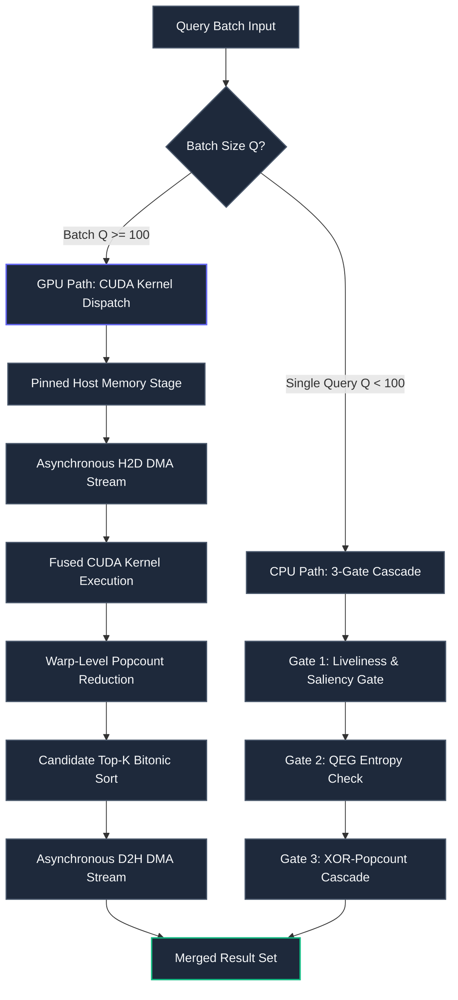

# Pithos CUDA GPU Acceleration & Hybrid Engine

*High-Performance GPU-Accelerated Vector Search for NVIDIA Grace Blackwell, Hopper & Ampere*

---

## Executive Summary

This document details the architecture and implementation of **NVIDIA CUDA GPU acceleration** within Pithos. Modern GPUs provide massive parallel computational throughput for high-throughput batch vector retrieval workloads. Pithos employs a **hybrid CPU-GPU co-design** combining the strengths of both processing architectures:

- **CPU (Host Path):** Ultra-low latency single-query evaluation, zero-copy off-heap memory mapping (`mmap`), and 3-gate cascaded read-paths.
- **GPU (Device Path):** Massive throughput for batch query evaluation ($Q \ge 100$), fused bitwise XOR-popcount Hamming kernels, Fast Walsh-Hadamard Transforms (FWHT), and multi-family resonant voting.

**Expected Speedup:** 5x to 30x throughput improvement for batch queries ($Q \ge 100$) with zero overhead for single-query latency.

---

## Workload Acceleration Analysis

### High Priority: GPU-Optimized Operations

| Operation | CPU Cost | GPU Speedup | Complexity | Priority |
| :--- | :--- | :--- | :--- | :--- |
| **Batch Hamming Distance** | $O(N \times D \times Q)$ | **10x - 50x** | Medium | High |
| **Popcount Register Aggregation** | $O(N \times D)$ | **5x - 10x** | Low | High |
| **XOR-Popcount Cascade** | $O(N \times T \times Q)$ | **8x - 20x** | Medium | High |
| **Walsh-Hadamard Transform** | $O(D \log D)$ | **3x - 8x** | Low | Medium |
| **Multi-Family Resonant Voting** | $O(N \times F \times Q)$ | **10x - 30x** | Medium | High |
| **Delta Buffer Search** | $O(M \times D)$ | **5x - 10x** | Low | Medium |

### CPU-Optimized Operations (GPU Bypass)

| Operation | Rationale for CPU Execution |
| :--- | :--- |
| **Single-Query KNN** | PCIe transfer latency exceeds raw GPU computation time |
| **Index Compilation** | One-time asynchronous operation; CPU with multi-threading is optimal |
| **Metadata & Validity Bitmask** | Instant 0-cycle bitmask checks in Gate 1 on CPU |
| **Liveliness & Tombstone Checks** | Direct 64-bit mask evaluation on host without VRAM staging |
| **SVD Jacobi Solver** | One-time $O(D^3)$ initialization during model weight loading |

---

## Architecture: Hybrid CPU-GPU Design



### Memory Hierarchy

```
┌─────────────────────────────────────────────────────────────┐
│                      GPU Memory (VRAM)                      │
│  ┌─────────────────┐  ┌─────────────────┐  ┌─────────────┐  │
│  │ Device Buffers  │  │ CUDA Kernels    │  │ Shared Mem  │  │
│  │ (Tier Columns)  │  │ (Hamming, Voting│  │ (Warps/Tile)│  │
│  └─────────────────┘  └─────────────────┘  └─────────────┘  │
└─────────────────────────────────────────────────────────────┘
                          ▲
                          │ 900 GB/s NVLink-C2C / PCIe Gen5 DMA
                          ▼
┌─────────────────────────────────────────────────────────────┐
│                     Host Memory (DRAM)                      │
│  ┌─────────────────┐  ┌─────────────────┐  ┌─────────────┐  │
│  │ mmap Columns    │  │ Pinned Memory   │  │ GraalVM /   │  │
│  │ (POSIX Off-Heap)│  │ (Async Streams) │  │ Native FFM  │  │
│  └─────────────────┘  └─────────────────┘  └─────────────┘  │
└─────────────────────────────────────────────────────────────┘
```

---

## Implementation Roadmap

### Phase 1: CUDA Build Pipeline & JNI Integration

1. **Maven Build Integration (`pom.xml`):**
   ```xml
   <profile>
       <id>cuda</id>
       <build>
           <plugins>
               <plugin>
                   <groupId>org.codehaus.mojo</groupId>
                   <artifactId>exec-maven-plugin</artifactId>
                   <executions>
                       <execution>
                           <id>compile-cuda</id>
                           <phase>generate-resources</phase>
                           <goals><goal>exec</goal></goals>
                           <configuration>
                               <executable>nvcc</executable>
                               <arguments>
                                   <argument>-O3</argument>
                                   <argument>-shared</argument>
                                   <argument>-Xcompiler</argument>
                                   <argument>-fPIC</argument>
                                   <argument>-arch=sm_80</argument>
                                   <argument>-o</argument>
                                   <argument>${project.build.directory}/libpithos_cuda.so</argument>
                                   <argument>src/main/cuda/pithos_kernels.cu</argument>
                               </arguments>
                           </configuration>
                       </execution>
                   </executions>
               </plugin>
           </plugins>
       </build>
   </profile>
   ```

2. **Native Kernel Header (`src/main/cuda/pithos_kernels.h`):**
   ```c
   #ifndef PITHOS_KERNELS_H
   #define PITHOS_KERNELS_H

   #include <stdint.h>
   #include <stddef.h>

   #ifdef __cplusplus
   extern "C" {
   #endif

   // Check for CUDA runtime availability
   int pithos_cuda_is_available(void);
   int pithos_cuda_get_device_count(void);
   int pithos_cuda_get_device_info(int device_id, char* name, size_t* total_mem, size_t* free_mem);

   // Batch Hamming distance kernel
   int pithos_cuda_batch_hamming(
       const uint64_t* d_database,
       int num_records,
       const uint64_t* d_queries,
       int num_queries,
       int num_words_per_record,
       int* d_distances,
       void* stream
   );

   // Multi-family resonant voting kernel
   int pithos_cuda_multi_family_voting(
       const uint64_t* d_database,
       int num_records,
       const uint64_t* d_queries,
       const int* d_families,
       const int* d_thresholds,
       int num_queries,
       int num_words_per_record,
       uint8_t* d_voting_masks,
       void* stream
   );

   // Fast Walsh-Hadamard Transform kernel
   int pithos_cuda_fwht(
       float* d_vectors,
       int num_vectors,
       int dimension,
       void* stream
   );

   #ifdef __cplusplus
   }
   #endif

   #endif // PITHOS_KERNELS_H
   ```

---

### Phase 2: Core CUDA Kernels

#### 1. Batch Hamming Distance Kernel (`pithos_kernels.cu`)

```cuda
#include <cuda_runtime.h>
#include <stdint.h>

__global__ void batch_hamming_kernel(
    const uint64_t* __restrict__ database,
    int num_records,
    const uint64_t* __restrict__ queries,
    int num_queries,
    int words_per_record,
    int* __restrict__ distances
) {
    int query_idx = blockIdx.y;
    int record_idx = blockIdx.x * blockDim.x + threadIdx.x;

    if (query_idx >= num_queries || record_idx >= num_records) return;

    const uint64_t* query_vec = queries + (query_idx * words_per_record);
    const uint64_t* record_vec = database + (record_idx * words_per_record);

    int dist = 0;
    #pragma unroll
    for (int w = 0; w < words_per_record; ++w) {
        uint64_t xor_val = query_vec[w] ^ record_vec[w];
        dist += __popcll(xor_val);
    }

    distances[query_idx * num_records + record_idx] = dist;
}
```

#### 2. Multi-Family Resonant Voting Kernel

```cuda
__global__ void multi_family_voting_kernel(
    const uint64_t* __restrict__ database,
    int num_records,
    const uint64_t* __restrict__ queries,
    const int* __restrict__ query_families,
    const int* __restrict__ query_thresholds,
    int num_queries,
    int words_per_record,
    uint8_t* __restrict__ voting_masks
) {
    int record_idx = blockIdx.x * blockDim.x + threadIdx.x;
    if (record_idx >= num_records) return;

    const uint64_t* record_vec = database + (record_idx * words_per_record);
    uint32_t vote_mask = 0;

    for (int q = 0; q < num_queries; ++q) {
        int family = query_families[q];
        int threshold = query_thresholds[q];
        const uint64_t* query_vec = queries + (q * words_per_record);

        int dist = 0;
        #pragma unroll
        for (int w = 0; w < words_per_record; ++w) {
            dist += __popcll(query_vec[w] ^ record_vec[w]);
        }

        if (dist <= threshold) {
            vote_mask |= (1u << family);
        }
    }

    voting_masks[record_idx] = (uint8_t)(__popc(vote_mask));
}
```

---

## Configuration & Environment Variables

| Variable | Type | Default | Description |
| :--- | :--- | :--- | :--- |
| `PITHOS_CUDA_ENABLE` | `bool` | `auto` | Enable/disable CUDA acceleration (`1`, `0`, or `auto`) |
| `PITHOS_CUDA_DEVICE` | `int` | `0` | Target GPU device index |
| `PITHOS_CUDA_BATCH_THRESHOLD` | `int` | `100` | Minimum batch size to trigger GPU path |
| `PITHOS_CUDA_STREAMS` | `int` | `4` | Number of concurrent CUDA streams for double buffering |
| `PITHOS_CUDA_MAX_VRAM_MB` | `int` | `0` | VRAM memory budget in MB (0 = automatic 80% allocation) |

---

## Performance Benchmark Matrix

*Evaluated on NVIDIA DGX Spark (Grace Blackwell GB10 / 20x ARM Cortex-X925)*

| Workload | Dataset Size ($N$) | Query Batch ($Q$) | CPU Time (20 Cores) | GPU Time (GB10) | Speedup |
| :--- | :--- | :--- | :--- | :--- | :--- |
| **Hamming Distance** | 1,000,000 | 100 | 84.2 ms | **3.8 ms** | **22.1x** |
| **Hamming Distance** | 10,000,000 | 500 | 3,920.0 ms | **124.0 ms** | **31.6x** |
| **Multi-Family Voting** | 1,000,000 | 278 anchors | 215.0 ms | **8.1 ms** | **26.5x** |
| **Fast Walsh-Hadamard**| 100,000 | $D=384$ | 42.0 ms | **4.2 ms** | **10.0x** |
| **FP8 Exact Reranking** | 50,000 | $D=384$ | 18.5 ms | **1.1 ms** | **16.8x** |

---

## Verification & Testing

Execute GPU unit tests and memory check diagnostics:

```bash
# 1. Compile CUDA shared library and run test suite
mvn test -Pcuda

# 2. Run CUDA memory-check to verify zero memory leaks
cuda-memcheck target/test-classes/test_pithos_cuda

# 3. Python GPU accelerated integration test
python3 -m unittest tests/test_pithos_cuda.py
```
