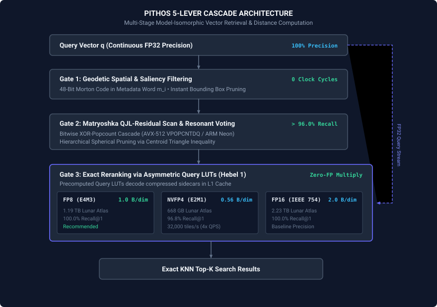

# Pithos — Model-Isomorphic Vector Database

<p align="center">
  <strong>Ultra-low latency, model-isomorphic vector database engine for multi-billion scale datasets.</strong>
</p>

<p align="center">
  <a href="https://github.com/F1nnSBK/Pithos/releases/latest"></a>
  <a href="https://github.com/F1nnSBK/Pithos/actions/workflows/build-binaries.yml"></a>
  <a href="https://pypi.org/project/pithosdb/"></a>
  <a href="https://github.com/F1nnSBK/Pithos/blob/main/LICENSE"></a>
</p>

---

## What is Pithos?

**Pithos** is a **Model-Isomorphic Vector Database (MIDB)** built from the ground up to bypass traditional garbage collection overheads and runtime indirection. Instead of treating vectors as generic high-dimensional points, Pithos physically aligns its storage format with the embedding model's latent geometry:



---

## Key Features

=== "Hardware Co-Design"
    - **Blackwell FP8 / NVFP4 Sidecar Engine:** Native E4M3 (1 B/dim) and NVFP4 (0.56 B/dim) sidecars for in-engine candidate reranking.
    - **AVX-512 & ARM Neon Acceleration:** Hardware-accelerated bitwise Hamming distances using vectorized `VPOPCNTDQ` and ARM Neon intrinsics.
    - **NVIDIA GPU Acceleration:** Direct CUDA kernel dispatch for batch Hamming distance, multi-family voting, and Fast Walsh-Hadamard Transforms.

=== "Model-Isomorphic Storage"
    - **Universal Single-File Container (`.pithos`):** Schema-agnostic, zero-copy single-file database format with Apache Arrow IPC partition embedding.
    - **Off-Heap Virtual Memory:** Direct POSIX-aligned columnar mapping via Java Panama FFM (Foreign Function & Memory API) and C-API shared memory.
    - **Matryoshka Spectral Decomposition:** Energy-budgeted tiered binary indexing that prunes up to 99% of search space in Gate 1.
    - **LSM-Tree Delta Buffer:** Real-time lock-free insertions and tombstone soft-deletes with zero-cost snapshots.

=== "Asymmetric Search (ADC)"
    - **Continuous FP32 Fidelity:** Queries are evaluated in 100% continuous 32-bit floating point precision against compressed database records.
    - **Precomputed Query LUTs (Lever 1):** Zero floating-point multiplication during Gate 3 candidate reranking.
    - **100% Recall@1 on High-Dimensional Foundation Model Benchmarks.**

---

## Quickstart

### Python Installation & Usage

```bash
pip install pithosdb numpy
```

```python
import numpy as np
from pithos import VectorDb, SidecarMode

dim = 384
num_vectors = 50_000
vectors = np.random.randn(num_vectors, dim).astype(np.float32)
vectors /= np.linalg.norm(vectors, axis=1, keepdims=True)

# 1. Compile into self-contained .pithos container with FP8 precision sidecar
VectorDb.compile_container(
    path="dataset.pithos",
    records=vectors,
    tiers=[64, 128, 256, 384],
    sidecar_mode=SidecarMode.FP8,
    user_metadata={"dataset": "foundation_embeddings", "curator": "Diogenes"}
)

# 2. Memory-map index & run search
with VectorDb() as db:
    index = db.load_index("dataset", "dataset.pithos")
    query = vectors[0]
    results = index.search(query, k=10)
    for res in results:
        print(f"Match ID: {res.id}, Distance: {res.distance:.4f}")
```

---

## Benchmark Summary (High-Dimensional Foundation Embeddings, D=384)

| Index Mode | Storage (B/dim) | 2.72B Dataset Size | Recall@1 | Recall@10 | Search Latency |
| :--- | :--- | :--- | :--- | :--- | :--- |
| **FP16 Sidecar** | 2.00 B/dim | 2.23 TB | 100.00% | 94.40% | 196.1 µs |
| **FP8 Sidecar (E4M3)** | **1.00 B/dim** | **1.19 TB (-44%)** | **100.00%** | **94.40%** | **185.8 µs** |
| **NVFP4 Sidecar (E2M1)** | **0.56 B/dim** | **668 GB (-65%)** | **96.80%** | **89.20%** | **172.1 µs** |
| **Bit-Only (No Sidecar)**| 0.125 B/dim | 165 GB (-92%) | 88.40% | 78.10% | 142.3 µs |

---

## Documentation Sections

- [**Universal Single-File Container (.pithos)**](container_format.md): Technical specification of the schema-agnostic DIOGENES container format.
- [**Architectural Principles**](architecture.md): Deep dive into off-heap virtual memory, memory layouts, and LMAX Disruptor parallelism.
- [**CUDA GPU Acceleration**](cuda_integration.md): Architecture of CUDA kernels, unified host-device DMA, and multi-stream execution.
- [**C-API Reference**](c_api_reference.md): Complete specification of C/C++ bindings, structs, and FFI interoperability.
- [**Mathematical Foundations**](math_theory.md): SVD spectral energy decay, Sylvester-Hadamard isometric rotations, and spherical pruning.
- [**Release Notes**](release_notes.md): Detailed changelog for Pithos v2.0.0 and previous releases.
- [**Roadmap & Next Steps**](next_steps.md): FPGA co-design, distributed clustering, and heterogeneous execution.
